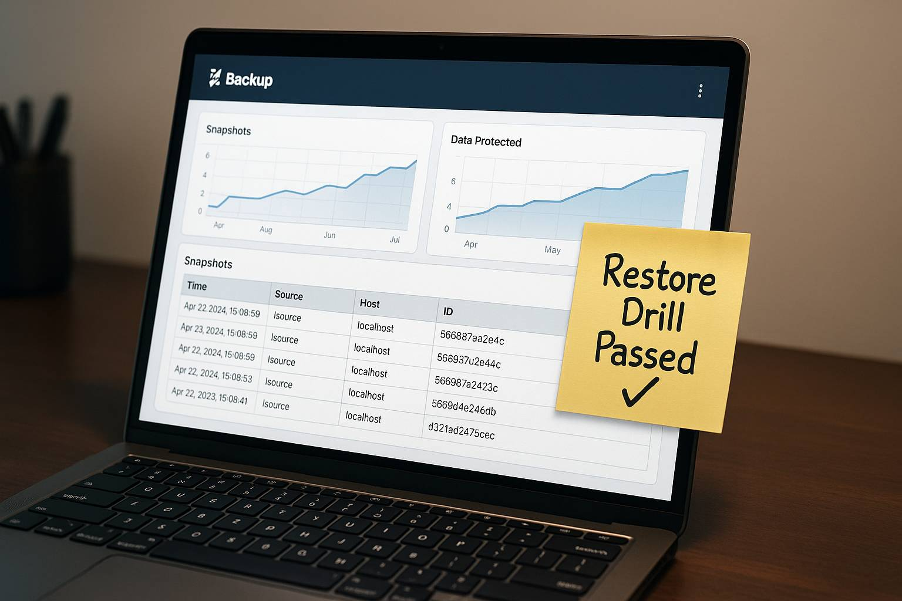

markdown
# Debian Kopia Backup Stack

[](https://opensource.org/licenses/MIT)
[](https://github.com/elightsys/debian-kopia-backup-stack/generate)
[](https://github.com/elightsys/debian-kopia-backup-stack/actions/workflows/shellcheck.yml)
[](https://www.gnu.org/software/bash/)

<p align="center">
  
</p>

Production-ready backup template for **Debian 12 + Docker**:

- 🔐 **Kopia** repository (encrypted, deduplicated) with **Web UI**
- 🗄️ **Database dumps** (MariaDB/PostgreSQL) before each snapshot
- 🕒 **systemd timers** for scheduled backups & monthly restore drills
- 🚨 **Healthchecks** pings + optional **Apprise** (email/Telegram/push)
- 💿 **ReaR** (Relax‑and‑Recover) for bare‑metal host recovery

> Turn this into your public boilerplate and re-use it across servers.

## Requirements

- Debian 12 host (root/systemd)
- Docker Engine + Docker Compose v2

## Quick start (local test)

1. **Clone and prepare secrets**:
   ```bash
   git clone https://github.com/elightsys/debian-kopia-backup-stack.git
   cd debian-kopia-backup-stack
   cp -r secrets.example secrets
   # Edit secrets/kopia_repo_password.txt and secrets/kopia_ui_password.txt
   ```

2. **Configure environment**:
   ```bash
   cp .env.example .env
   # Edit .env: set TZ (e.g., Europe/Budapest) and KOPIA_USERNAME
   ```

3. **Start services** (Kopia, Apprise, Healthchecks):
   ```bash
   make up
   ```

4. **Trigger your first backup**:
   ```bash
   make backup
   ```

5. **Open the Kopia Web UI** at `http://<server>:51515`  
   → login with your `KOPIA_USERNAME` and the password from `secrets/kopia_ui_password.txt`.

### What gets snapshotted by default?
- `./data/docker/`  → put your Docker configs/volumes you want to include
- `./data/etc/`     → copy/rsync system config you want to preserve
- `./data/var_lib/`
- `./data/home/`
- `./data/db_dumps/` → the DB dumps generated right before snapshots

> In production, point these to your real paths (e.g. `/mnt/raid/...`).

## Retention policy (default)
- keep latest **5**
- **7** daily, **4** weekly, **12** monthly, **2** annual

## Restore examples

- List snapshots:
  ```bash
  docker exec kopia sh -lc 'kopia snapshots list'
  ```
- Restore the latest docker set into a temp folder inside the container:
  ```bash
  docker exec kopia sh -lc 'kopia restore latest:/source/docker --target /tmp/restore_docker'
  docker cp kopia:/tmp/restore_docker ./_restores/manual-$(date +%F-%H%M)
  ```

## Alerts
- **Healthchecks**: set `HC_URL` env var for `scripts/backup.sh` to ping on success/failure
- **Apprise**: set `APPRISE_URL` to send email/Telegram/push, e.g. `http://apprise:8008/notify?tag=email,telegram`

## Bare‑metal recovery (ReaR)
See `docs/RECOVERY-ReaR.md` for installing ReaR on the host and scheduling weekly ISO + NETFS backups.

## Security
- Kopia repo is password-protected (don’t lose it)
- This template includes `.gitignore` rules to keep secrets out of Git
- Follow the 3‑2‑1 backup rule: 3 copies, 2 media, 1 offsite

## License
Copyright © 2025 Zoltan Vlasits.
Licensed under [MIT](./LICENSE).
